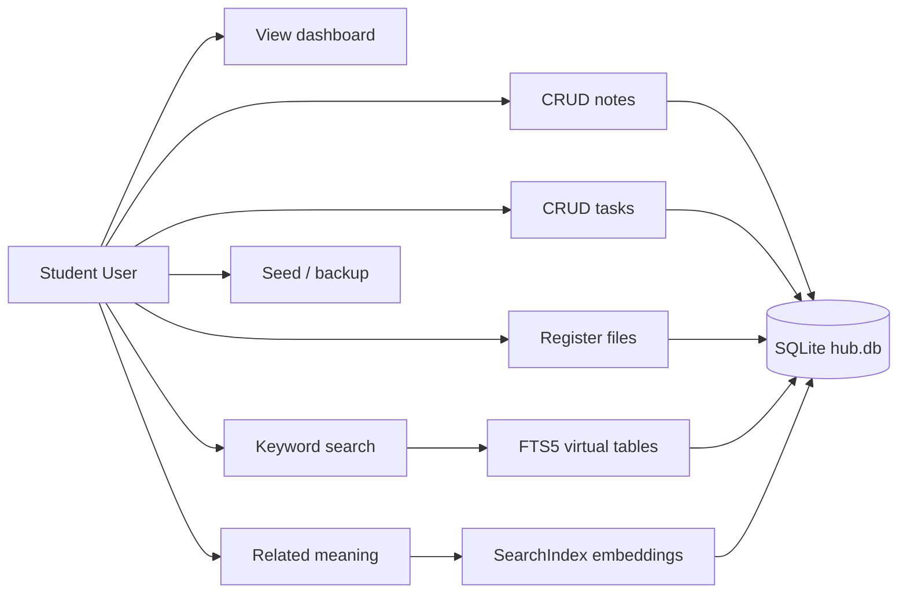
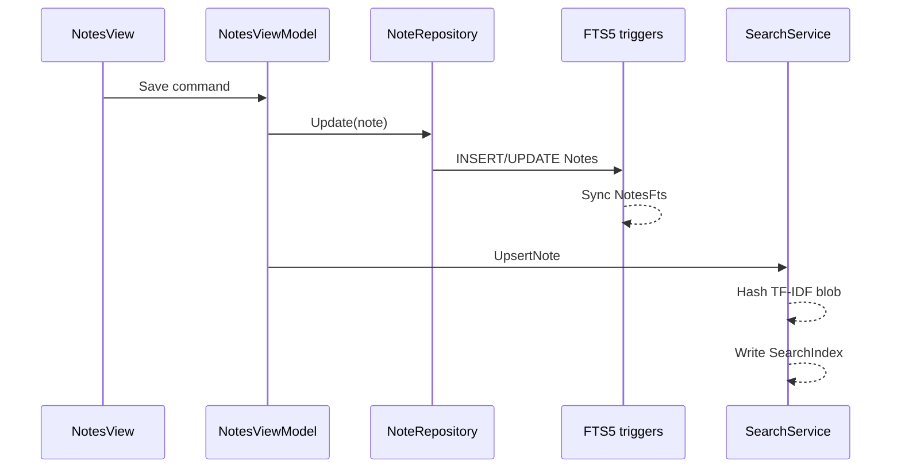
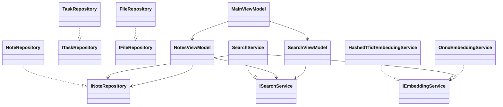

# Smart Personal Knowledge Hub — A Windows Desktop Application for Notes, Tasks, Files and Local AI Search

**A project report submitted in partial fulfilment of the requirements for the degree of**  
Master of Technology in Computer Science and Engineering

**Author:** Hossein Tabasi  
**GitHub:** hosseinTabasi  
**Department:** Computer Science and Engineering  
**Institution:** Shoolini University  
**Year:** 2026  

**Supervisor:** [to be filled by student]

---

## Abstract

Personal knowledge work on a student laptop is still fragmented across sticky notes, cloud notebooks and ordinary files. Notion, OneNote and Obsidian offer capable editors, yet they depend on an online account, a markdown vault, or a closed schema. This project presents Smart Personal Knowledge Hub, a WPF application that stores notebooks, notes, tasks and file metadata in one SQLite database under LocalAppData. The client is offline: there is no login, synchronisation or telemetry. Keyword retrieval uses the SQLite FTS5 extension with bm25 ranking over notes, tasks and extracted text from txt, markdown and csv files. A second mode, labelled Related meaning, ranks items by cosine similarity of hashed TF-IDF vectors without downloading a neural model. An optional ONNX MiniLM file may be added later; if it is absent the application still starts. Domain logic lives in a net8.0 class library, which allowed 28 xUnit tests to run on Linux against a temporary database, while the WPF shell targets net8.0-windows. The contribution is a complete, examinable MVVM artefact rather than a commercial replacement for existing personal knowledge bases.

**Keywords:** personal knowledge base, WPF, MVVM, SQLite, FTS5, bm25, TF-IDF, Windows desktop

---

## 1. Introduction and problem statement

Vannevar Bush argued that a scholar needs a personal machine for associative trails through notes and records [1]. Decades later, Davies and colleagues studied *personal knowledge bases* (PKBs) as systems that help an individual capture, organise and retrieve their own material [2], [3]. Contemporary students still live in that problem: lecture notes, assignment checklists and downloaded files sit in different applications, and a search box that only matches exact keywords misses near-meaning such as “full-text ranking” versus “FTS5 bm25”.

Commercial PKBs and notebooks are abundant. They are not, however, a substitute for an undergraduate or M.Tech software-engineering project whose learning outcomes are layered architecture, testable domain services and a local data file the examiner can open. Cloud notebooks hide storage behind accounts. Markdown vaults such as Obsidian are excellent for writing, but they do not by themselves teach WPF, MVVM or SQL. Windows Sticky Notes is too small for tasks, tags and file metadata.

**Problem statement.** Design and implement an *offline* Windows desktop hub that (a) stores notes, tasks and file records in SQLite, (b) supports keyword search with a documented IR ranking function, (c) offers a second, fully local related-document ranking mode, and (d) keeps user interface code free of business rules through MVVM.

The phrase “local AI search” in the title refers to this on-device ranking stack (FTS5 plus hashed TF-IDF, with an optional ONNX hook). It does not claim a trained production model or a user study.

## 2. Objectives

1. Build a WPF client with a NavigationView-style left rail and Fluent-inspired styling.
2. Persist notebooks, notes, tags, tasks and file metadata in a single SQLite database using parameterised SQL and WAL mode.
3. Provide CRUD for notes (including pin and archive), tasks (status, priority, due date, optional `NoteId`) and files (path registration, optional vault copy).
4. Index notes, tasks and extracted file text with FTS5; rank keyword queries with bm25 [5], [9].
5. Rank “Related meaning” with a hashed bag-of-words / TF-IDF cosine vector that runs offline.
6. Load `Assets/models/minilm.onnx` only when present; otherwise continue with FTS5 and TF-IDF [4], [12].
7. Isolate domain logic in `SmartKnowledgeHub.Core` (`net8.0`) so tests run without WPF.
8. Document setup, tests and viva points for a 6–10 week student schedule.

## 3. Scope and limitations

**In scope.** Single-user Windows desktop; local SQLite; notes with a plain `TextBox` (markdown-ish text, not a full editor); tasks; file *registration*; FTS5; hashed TF-IDF; optional ONNX file detection; sample seeder; backup and VACUUM.

**Out of scope.**

- Non-Windows UI. WPF is Windows-only [7], [10].
- Cloud sync, accounts, identity providers and telemetry.
- PDF parsers, OCR and binary document understanding.
- Shipping or downloading multi-hundred-megabyte models.
- Multi-user concurrency beyond SQLite’s WAL defaults.
- Controlled user experiments, AUC, or latency leaderboards. No such numbers are reported.

Sentence-BERT [4] is cited as the research context for optional dense embeddings, not as a result of this implementation.

## 4. Literature and existing tools

Bush’s Memex essay remains the canonical motivation for personal associative memory [1]. Davies surveyed PKB research and, with colleagues, prototyped Popcorn as an interactive personal knowledge base [2], [3]. Those works justify treating the student’s own corpus as a first-class database rather than as disposable UI state.

On the retrieval side, Robertson and Zaragoza present bm25 as a probabilistic ranking function [9]. SQLite implements an FTS5 extension that exposes MATCH queries and `bm25()` over virtual tables [5]. Dense sentence embeddings, notably Sentence-BERT [4], improve semantic similarity when a model is available; ONNX Runtime is one way to run such models on-device [12]. This project uses the classical IR path by default so that a campus laptop without a GPU still searches.

Presentation Model [8] and the WPF MVVM pattern [6], [7] separate state and commands from XAML. Fluent Design informs spacing, typography and navigation chrome [10]. Microsoft.Data.Sqlite is the supported ADO.NET provider for SQLite on .NET [11].

### 4.1 Comparison with existing products

Product behaviour is taken from public product pages (access date 2 September 2026), not from a laboratory user study.

| System | Typical deployment | Primary store | Search | Cost model | Suitability for this module |
| --- | --- | --- | --- | --- | --- |
| Notion [13] | Cloud workspace | Proprietary hosted | Full product search | Subscription tiers | Poor fit: account, network, closed schema |
| Microsoft OneNote [14] | Cloud + device | Microsoft 365 / local cache | In-notebook search | Bundled with M365 | Capable notebook; not a teaching SQLite artefact |
| Obsidian [15] | Local markdown vault | Folder of `.md` files | Vault search + plugins | Free core | Strong PKB; different stack (not WPF/SQLite/MVVM) |
| Windows Sticky Notes [16] | Local | Platform store | Limited | Free | Too small for tasks, tags, files and FTS |
| **This work** | Offline WPF | Inspectable SQLite | FTS5 bm25 + TF-IDF cosine | MIT, no account | Designed for CSE coursework |

**Justification of a custom app.** A student needs (i) privacy (data never leaves the PC), (ii) inspectability (the examiner can open `hub.db`), (iii) MVVM practice on WPF, and (iv) no subscription. Those constraints are poorly served by the commercial row of the table even when those products are better writers’ tools.

## 5. System analysis

### 5.1 Actors

A single **Student User** operates the application on their own Windows PC. There is no administrator role and no remote client.

### 5.2 Functional requirements

| ID | Requirement |
| --- | --- |
| FR1 | Create, read, update and delete notes with title, body, notebook, tags, pin and archive. |
| FR2 | Create, read, update and delete tasks with status, priority, optional due date and optional linked note. |
| FR3 | Register a local file; optionally copy it into the application vault; open it with the OS. |
| FR4 | Extract text only from `.txt`, `.md` and `.csv`; skip binaries. |
| FR5 | Keyword search across notes, tasks and files using FTS5 and bm25. |
| FR6 | Related-meaning ranking using local embeddings (default hashed TF-IDF). |
| FR7 | Dashboard showing counts, recent notes and due tasks. |
| FR8 | Settings: show data paths, seed sample data, VACUUM, backup copy of the database. |
| FR9 | Persist everything in one SQLite file; start without a network. |

### 5.3 Non-functional requirements

| ID | Requirement |
| --- | --- |
| NFR1 | Parameterised SQL only. |
| NFR2 | Views contain no business rules beyond `InitializeComponent` (and application composition). |
| NFR3 | Core library targets `net8.0` so tests run on Linux. |
| NFR4 | Missing ONNX model must not prevent start-up. |
| NFR5 | Fluent-inspired light UI (Segoe UI Variable, rounded cards, left rail). |
| NFR6 | No telemetry. |

### 5.4 Use cases

UC1 View dashboard; UC2 Manage notebooks; UC3 Edit notes; UC4 Filter and edit tasks; UC5 Register and open files; UC6 Keyword search; UC7 Related-meaning search; UC8 Seed sample data; UC9 Backup or vacuum the database.

### 5.5 Activity and data flow

A typical “save note then search” path is: the view binds editor fields to `NotesViewModel`; Save calls `INoteRepository.Update`; SQLite triggers refresh `NotesFts`; the view-model calls `ISearchService.UpsertNote`, which writes `SearchIndex` text and a float32 embedding blob. A later keyword query runs `MATCH` on the FTS tables. A related-meaning query embeds the query string and computes cosine similarity against stored blobs.

File text does not use content-table triggers: `FileRepository.Insert` writes `Files` and `FilesFts` in one transaction because extracted text is not a column of `Files`.

## 6. System design

### 6.1 Layering

| Layer | Project | Contents |
| --- | --- | --- |
| Presentation | `SmartKnowledgeHub.App` | XAML views, Fluent resources, converters, view-models, `IUserPrompt` |
| Domain / data | `SmartKnowledgeHub.Core` | Models, repositories, `DbInitializer`, search, embeddings, seeder |
| Tests | `SmartKnowledgeHub.Tests` | xUnit against a temp folder |

`App.xaml.cs` constructs `ServiceCollection`, registers Core services as singletons, and assigns `MainViewModel` as `MainWindow.DataContext`. Navigation is a bound `CurrentViewModel` with data templates per view-model type [6], [8].

### 6.2 Schema

Logical schema (SQLite):

- `Notebooks(Id INTEGER PK, Name TEXT NOT NULL, CreatedUtc TEXT)`
- `Notes(Id, NotebookId FK, Title, Body, IsPinned, IsArchived, CreatedUtc, UpdatedUtc)`
- `Tags(Id, Name UNIQUE)`
- `NoteTags(NoteId, TagId)` composite primary key
- `Tasks(Id, Title, Body, DueUtc, Priority INTEGER, Status TEXT, NoteId NULL FK, CreatedUtc, UpdatedUtc)`
- `Files(Id, OriginalPath, VaultPath, FileName, Extension, SizeBytes, TagsCsv, CreatedUtc)`
- `SearchIndex(Id, EntityType, EntityId, Text, EmbeddingBlob)` unique on `(EntityType, EntityId)`
- `NotesFts`, `TasksFts`, `FilesFts` — FTS5 virtual tables

Timestamps are ISO-8601 UTC strings. WAL and `foreign_keys=ON` are applied when a connection opens [11].

### 6.3 Class view

`EmbeddingFactory.CreateDefault` probes the optional ONNX path and always returns a working `IEmbeddingService` (hashed TF-IDF when the model is missing or unusable).

## 7. Implementation

### 7.1 Key Core types

- `SqliteConnectionFactory` — connection string, WAL, foreign keys.
- `DbInitializer` — idempotent DDL including FTS5 and triggers.
- `NoteRepository` / `TaskRepository` / `FileRepository` / `TagRepository` — parameterised CRUD.
- `TextExtractor` — extension allow-list and NUL-byte binary guard.
- `SearchService.KeywordSearch` — quoted OR tokens, `snippet()` and `bm25()`.
- `HashedTfidfEmbeddingService` — SHA-256 feature hashing into 256 dimensions, TF, smoothed IDF, L2 norm, cosine.
- `SampleDataSeeder` — 10 notes, 6 tasks, 3 files; refuses to run when data already exist.
- `FileVaultService` — optional copy under `vault\`.
- `DatabaseMaintenance` — `VACUUM` and file copy backup.

### 7.2 MVVM in the App project

View-models are `partial` classes using `[ObservableProperty]` and `[RelayCommand]` from CommunityToolkit.Mvvm [6]. Examples:

- `MainViewModel.Navigate` switches `CurrentViewModel` and refreshes the target page.
- `NotesViewModel` holds editor fields separate from the list until Save.
- `SearchViewModel.UseRelatedMeaning` selects keyword versus cosine ranking.
- `SettingsViewModel` exposes paths as read-only strings.

Code-behind files call `InitializeComponent` only. Dialogs and `Process.Start` go through `IUserPrompt` so view-models do not own `MessageBox` types beyond the WPF project boundary.

### 7.3 SQLite and FTS5 usage

Content tables `Notes` and `Tasks` own the canonical text. After-insert/update/delete triggers keep `NotesFts` and `TasksFts` aligned with the FTS5 external-content pattern [5]. User queries are stripped of punctuation and emitted as `"token" OR "token"` to avoid treating user text as FTS operators. Ranking uses `ORDER BY bm25(...)` [9].

Related meaning does not use MATCH. It loads `SearchIndex`, embeds the query with the current corpus IDF, and sorts by cosine. Scores in the UI are shown as percentages when they fall in `[0, 1]`; they are *not* accuracy metrics.

### 7.4 Optional ONNX

`OnnxEmbeddingService` sets `IsAvailable` from `File.Exists(minilm.onnx)`. This build does not reference ONNX Runtime, so even if a student copies a model file, inference is not silently faked. Settings text explains the fallback. Adding Runtime remains future work [12].

### 7.5 User interface

`Themes/Fluent.xaml` defines a light Mica-like gradient, rounded cards, accent `#005FB8`, and a left rail of radio-styled navigation buttons [10]. Pages are UserControls: Dashboard, Notes (list + editor), Tasks, Files, Search, Settings. The note body is a multi-line `TextBox`; a full Markdown previewer was judged out of scope for the calendar.

## 8. Testing

### 8.1 Unit tests

On 2 September 2026 the Core test project was executed with .NET SDK 8.0.424 on Linux:

**Passed: 28. Failed: 0. Skipped: 0.**

Details live in `docs/TESTING.md`. Tests cover schema creation, note/task/file repositories, FTS keyword search, semantic ranking of a SQLite note above a cooking note, embedding cosine identities, ONNX-missing behaviour, seeder counts (10 / 6 / 3), dashboard aggregates, VACUUM and backup. They use a unique temporary directory per fixture; they do not touch a developer’s LocalAppData.

The WPF UI was **not** launched on Linux.

### 8.2 Manual tests

Sixteen Windows manual cases (M1–M16) are tabulated in `docs/TESTING.md` (first run, seed, CRUD, search modes, backup). They are acceptance checks, not a measured usability experiment.

## 9. Conclusion and future work

Smart Personal Knowledge Hub is a complete offline WPF client plus a testable Core library. It shows that a student PKB can combine inspectable SQLite storage, FTS5 bm25 search and a honest local surrogate for semantic ranking without shipping a large model or a cloud account. The work is a software-engineering artefact aligned with Bush’s and Davies’ PKB agenda [1]–[3], not a claim of superiority over Notion, OneNote or Obsidian.

**Future work.** (1) Wire ONNX Runtime when a MiniLM file is legally present and measure retrieval quality on a *declared* personal corpus. (2) A lightweight Markdown preview pane. (3) Incremental FTS rather than full `RebuildAll` after bulk import. (4) Optional encrypted-at-rest database. (5) A Windows backup-to-USB wizard. None of these items is required to demonstrate the current objectives.

## 10. References

[1] V. Bush, “As We May Think,” *The Atlantic Monthly*, vol. 176, no. 1, pp. 101–108, Jul. 1945.

[2] S. Davies, S. Allen, J. Raphaelson, E. Meng, J. Engleman, R. King, and C. Lewis, “Popcorn: the personal knowledge base,” in *Proc. 6th Conf. Designing Interactive Systems (DIS ’06)*, University Park, PA, USA, 2006, pp. 150–159, doi: 10.1145/1142405.1142431.

[3] S. Davies, “Building the Memex Sixty Years Later: Trends and Directions in Personal Knowledge Bases,” Univ. of Colorado Boulder, Tech. Rep. CU-CS-997-05, 2005. [Online]. Available: https://scholar.colorado.edu/csci_techreports/931

[4] N. Reimers and I. Gurevych, “Sentence-BERT: Sentence embeddings using Siamese BERT-networks,” in *Proc. 2019 Conf. Empirical Methods in Natural Language Processing and 9th Int. Joint Conf. Natural Language Processing (EMNLP-IJCNLP)*, Hong Kong, 2019, pp. 3982–3992.

[5] Hipp, Wyrick & Company, Inc., “SQLite FTS5 Extension.” [Online]. Available: https://www.sqlite.org/fts5.html

[6] Microsoft, “Introduction to the MVVM Toolkit,” .NET Community Toolkit documentation. [Online]. Available: https://learn.microsoft.com/en-us/dotnet/communitytoolkit/mvvm/

[7] J. Smith, “WPF Apps With The Model-View-ViewModel Design Pattern,” *MSDN Magazine*, Feb. 2009. [Online]. Available: https://learn.microsoft.com/en-us/archive/msdn-magazine/2009/february/patterns-wpf-apps-with-the-model-view-viewmodel-design-pattern

[8] M. Fowler, “Presentation Model,” 2004. [Online]. Available: https://martinfowler.com/eaaDev/PresentationModel.html

[9] S. Robertson and H. Zaragoza, “The Probabilistic Relevance Framework: BM25 and Beyond,” *Foundations and Trends in Information Retrieval*, vol. 3, no. 4, pp. 333–389, 2009.

[10] Microsoft, “Windows app design: Fluent Design,” Microsoft Learn. [Online]. Available: https://learn.microsoft.com/en-us/windows/apps/design/

[11] Microsoft, “Microsoft.Data.Sqlite overview,” Microsoft Learn. [Online]. Available: https://learn.microsoft.com/en-us/dotnet/standard/data/sqlite/

[12] ONNX Runtime, “ONNX Runtime documentation.” [Online]. Available: https://onnxruntime.ai/docs/

[13] Notion Labs, Inc., “Notion.” [Online]. Available: https://www.notion.so (accessed 2 Sep. 2026).

[14] Microsoft, “Microsoft OneNote.” [Online]. Available: https://www.microsoft.com/en-us/microsoft-365/onenote (accessed 2 Sep. 2026).

[15] Obsidian, “Obsidian.” [Online]. Available: https://obsidian.md (accessed 2 Sep. 2026).

[16] Microsoft, “Sticky Notes,” Microsoft Support. [Online]. Available: https://support.microsoft.com/en-us/windows (accessed 2 Sep. 2026).
